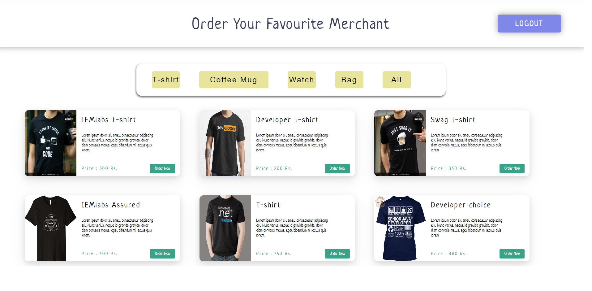
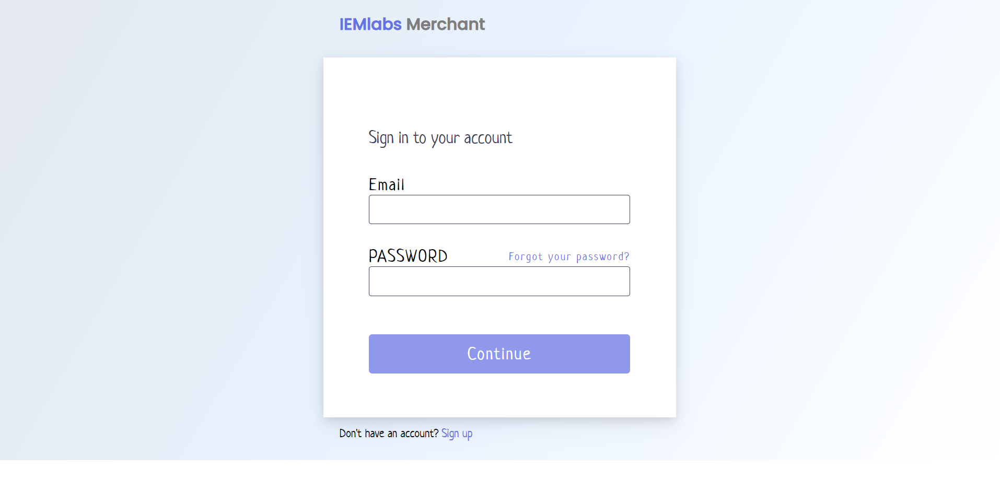
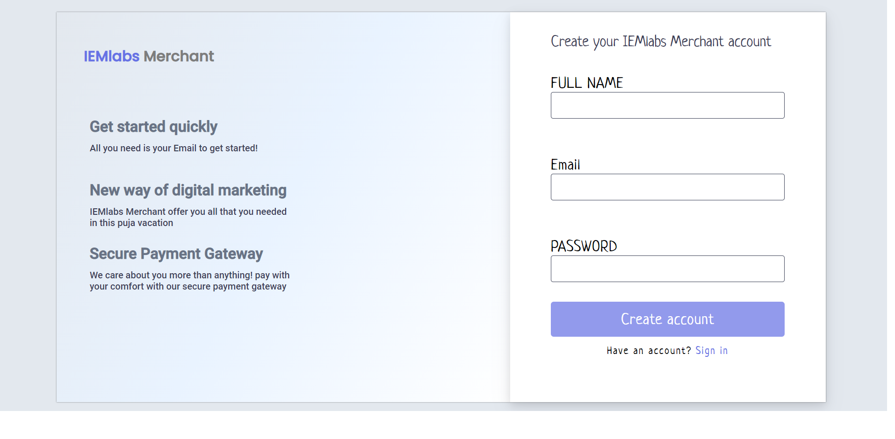

# Welcome To IEMLabs-Merchant

 <br /><br />
 <br /><br />
 <br /><br />


## This is a MERN stack e-commerce site with stripe Payment gateway integrated (Only card payment available right now).

## To check the backend of this project visit : https://github.com/Yourstruggle11/IEMlabs-Marchant-Server
 # NOTE

 ## ***This is not a real project by IEMLabs , this just an assignment for hiring process***


 # How to run this aplication locally

 01     ``` git clone https://github.com/Yourstruggle11/IEMlabs-Marchant-Client.git ```

 02      ``` cd IEMlabs-Marchant-Client  ```

 03      ```npm install ```

 04      ``` npm start ```

 05      ``` Open http://localhost:3000 ```

 # Site is live <a href="https://iemlabs-merchant.netlify.app/">HERE </a>


 
 